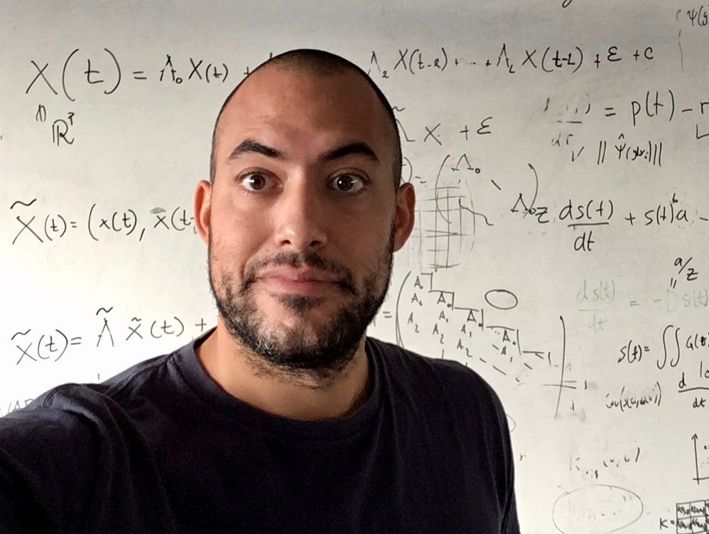

{:width="300px"}

I am a postdoc at Universitat de Valencia, in the [Image and Signal Processing Group](https://www.isp.uv.es)

### research interests

- probabilistic graphical models
- graphical models for dynamical systems
- staged event trees and chain event graphs
- causality and causal discovery from spatio-temporal data
- applications for the Earth sciences

## News  
